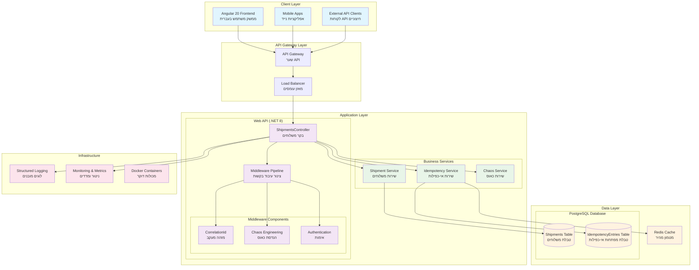
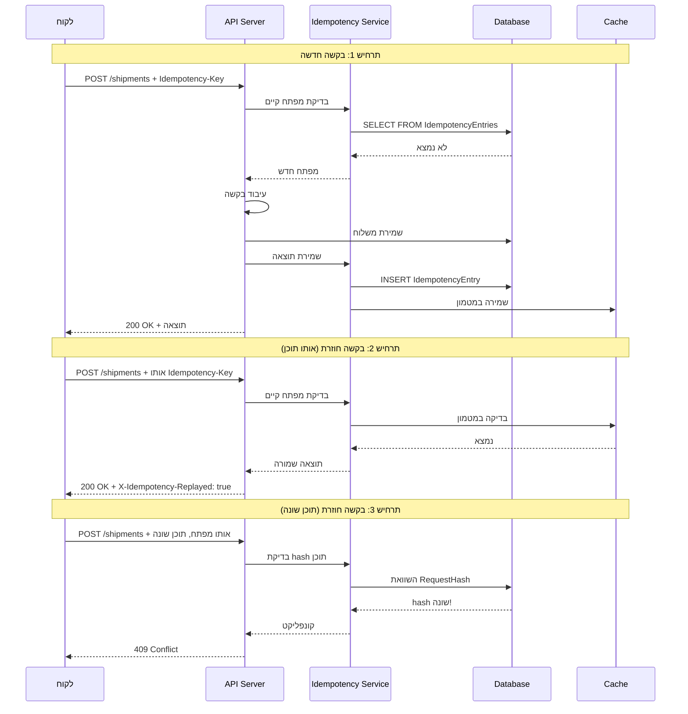
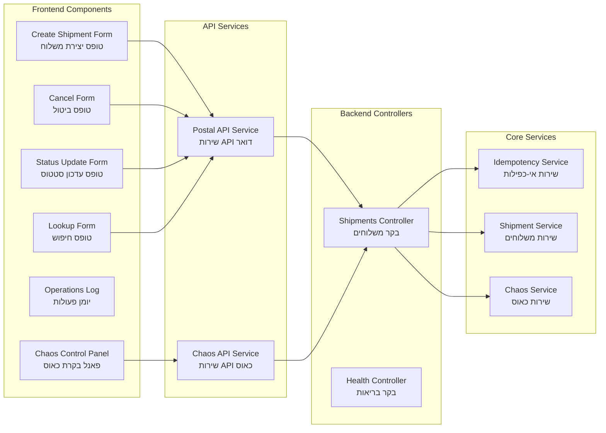
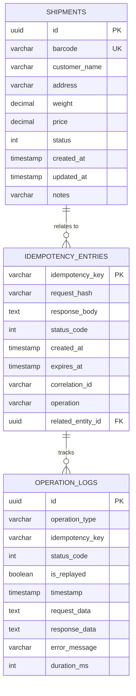

# Architecture - מערכת Idempotency לדואר

## Overview
מערכת דמו מתקדמת להדגמת דפוסי POST request idempotency במערכות דואר, המונעת כפילויות משלוחים וחיובים מיותרים.

## System Architecture Diagram

## Idempotency Flow Diagram

## Component Architecture

## Data Architecture

## Technology Stack

### Frontend (Angular 20)
- **Framework**: Angular 20 עם TypeScript
- **UI Library**: Angular Material Design
- **State Management**: RxJS Observables
- **HTTP Client**: Angular HttpClient עם Interceptors
- **Styling**: SCSS עם RTL support

### Backend (.NET 8)
- **Framework**: ASP.NET Core 8 Web API
- **ORM**: Entity Framework Core 8
- **Database**: PostgreSQL 15
- **Logging**: Serilog עם structured logging
- **Documentation**: OpenAPI/Swagger
- **Caching**: Redis (אופציונלי)

### Infrastructure
- **Containerization**: Docker & Docker Compose
- **Database**: PostgreSQL או Supabase
- **Monitoring**: Built-in health checks
- **CI/CD**: GitHub Actions (עתידי)

## Security Considerations

### Idempotency Security
- **Key Validation**: בדיקת תקינות מפתחות
- **Hash Verification**: SHA256 לאימות תוכן
- **TTL Management**: מחיקה אוטומטית של entries ישנים
- **Rate Limiting**: הגבלת קצב בקשות

### API Security
- **CORS Configuration**: הגדרות CORS מתאימות
- **Input Validation**: בדיקת קלט בכל השכבות
- **Error Handling**: טיפול מאובטח בשגיאות
- **Correlation Tracking**: מעקב בקשות עם IDs

## Scalability & Performance

### Horizontal Scaling
- **Stateless API**: שרת API ללא state
- **Database Sharding**: חלוקת נתונים (עתידי)
- **Load Balancing**: איזון עומסים
- **Caching Strategy**: אסטרטגיית מטמון

### Performance Optimizations
- **Connection Pooling**: מאגר חיבורי DB
- **Async Operations**: פעולות אסינכרוניות
- **Index Optimization**: אופטימיזציה של אינדקסים
- **Memory Management**: ניהול זיכרון יעיל

## Monitoring & Observability

### Logging Strategy
- **Structured Logs**: לוגים מובנים עם JSON
- **Correlation IDs**: מעקב בקשות חוצות מערכות
- **Performance Metrics**: מדדי ביצועים
- **Error Tracking**: מעקב שגיאות מפורט

### Health Monitoring
- **Health Checks**: בדיקות בריאות מערכת
- **Database Connectivity**: בדיקת חיבור DB
- **External Dependencies**: בדיקת תלויות חיצוניות
- **Resource Usage**: ניטור שימוש במשאבים
